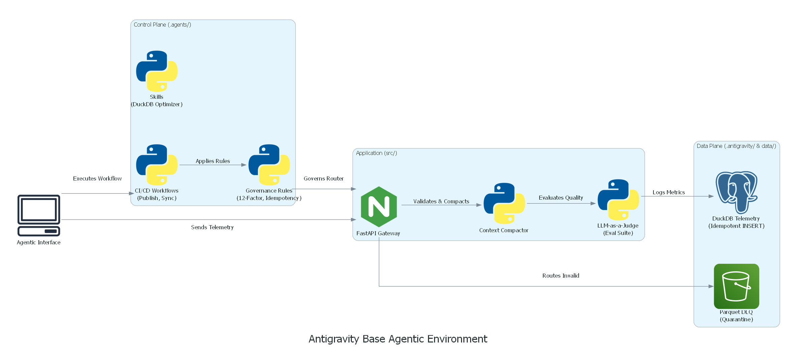
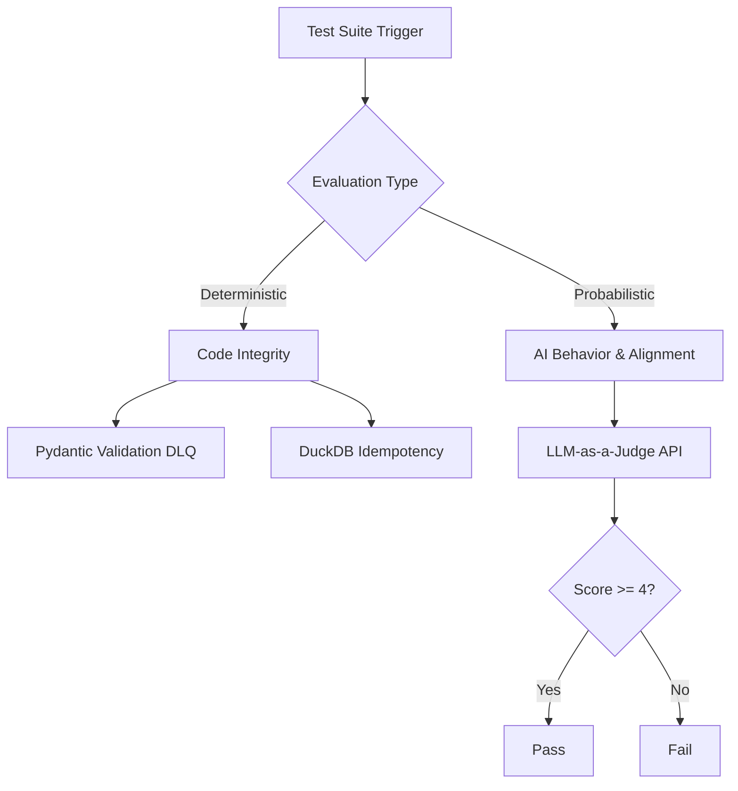

# 🌌 Antigravity Base Agentic Environment




## 📖 Overview
This repository serves as a powerful, extensible **Base Agentic Environment** built on the Antigravity framework. It utilizes a strict **Split-Plane Architecture** that separates the human-defined control plane (`.agents/`) from the system-managed data and state plane (`.antigravity/`). This ensures deterministic AI execution, zero-hallucination context management, and enterprise-grade reliability.

## 🚀 Dynamic Skill Integration
This workspace is designed to be highly composable. **As new skills and agents are developed in separate, isolated projects, they are continuously imported into this base environment.** This aggregation allows the environment to grow exponentially more powerful over time, consolidating isolated intelligence into a single, unified operating system.

## 🏗️ Dual-Prong Testing Architecture


## 🛠️ Current Capabilities

### Governance Rules (`.agents/rules/`)
* **LLM-as-a-Judge Eval:** Probabilistic evaluation of AI output quality.
* **Error Observability:** Mandatory error interception and AST compression via jCodeMunch.
* **12-Factor Governance:** Enforces stateless processes and BYOK configuration.
* **Context Compaction & Router Alignment:** Strict token conservation and payload mutation for Agentic AI.
* **Data Validation:** Idempotent DLQ routing via Pydantic.
* **SQL Standards:** Write-Ahead Logging and `INSERT OR REPLACE` idempotency via DuckDB.
* **Hugging Face Standards:** Zero-cost offsite WebUI routing deployment constraints.

### Specialized Skills (`.agents/skills/`)
* **DuckDB Optimizer:** Configures DuckDB for maximum reliability, data integrity, and memory safety.
* **Pipeline Architect:** Designs minimalist, fault-tolerant ETL pipelines using standard Python.

### Automated Workflows (`.agents/workflows/`)
* **CI/CD & Sync:** `master-sync`, `update-docs`, `publish-showcase`, `deploy-hf-production`, `secure-checkpoint`
* **Data Engineering:** `daily-ingestion`, `build-etl`, `error-recovery`
* **Bootstrapping:** `bootstrap`, `git-discovery-preflight`, `generate-readme`

## 📂 Directory Structure
```text
.
├── .agents/            # The Control Plane: Rules, Skills, and Workflows (Human Edited)
├── .antigravity/       # The Data Plane: System metrics, graphs, and cache (System Managed)
├── .config/            # Environment configurations and MCP integrations
├── src/                # Application source code (FastAPI, Routers)
├── data/               # DuckDB metrics, Quarantine DLQs, and Parquet files
└── hf-webui/           # Hugging Face Spaces frontend deployment configurations
```


## 🧬 How to Adopt This Environment
To test if this environment works as intended in your own projects, you do not need to rewrite your entire codebase. Instead, you inject the "Agentic Brain":

1. **Pull the Brain:** Copy the `.agents/` directory and the `HANDOVER.md` file from this repository into the root of your existing project.
2. **Summon the Agent:** Open your AI coding assistant (e.g., Cursor, Windsurf, or an Antigravity agent) in your project.
3. **Trigger the Handover:** Send your AI the following prompt:
   > *"Please read `@HANDOVER.md`. You must acknowledge the architecture constraints and the strict Rule 00 (No Unauthorized Deletions). Your absolute first action must be to execute `.agents/workflows/merge-conflict-resolution.md` to safely resolve any file collisions. Once I have manually approved the merge, proceed to `BOOTSTRAP.MD`."*
4. **Watch it Work:** The AI will automatically parse the strict governance rules, apply the context compactor, and begin aligning your legacy code to the production standards defined in `.agents/rules/`.
