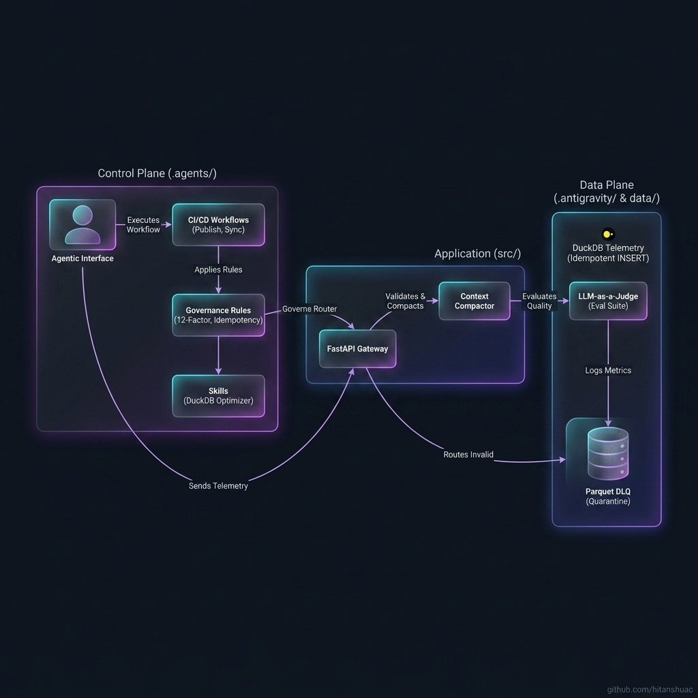
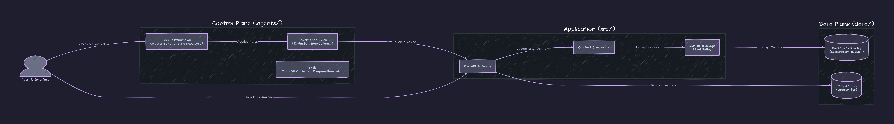
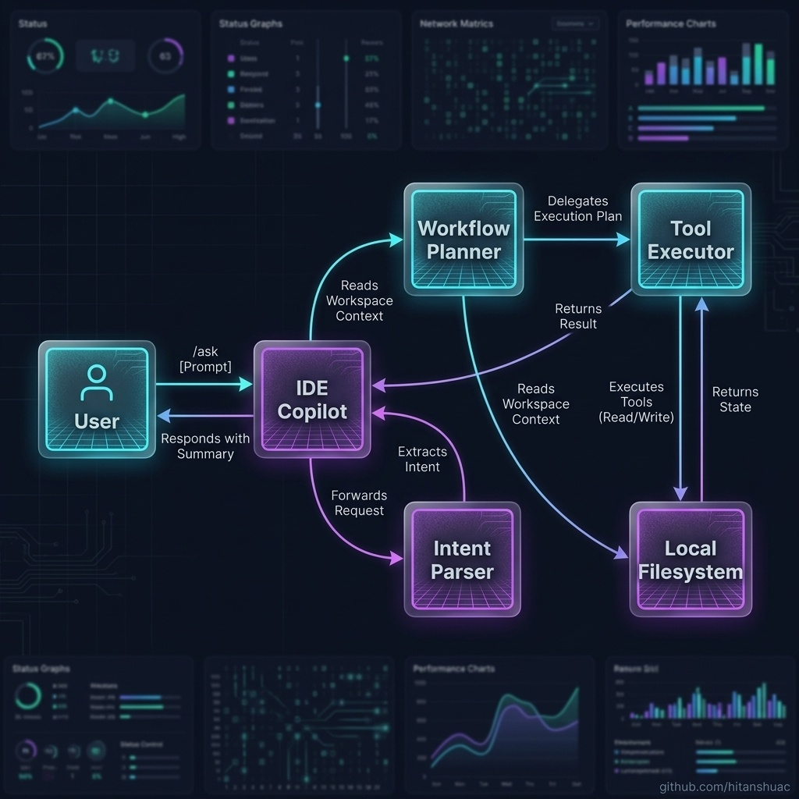
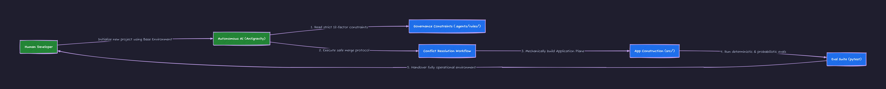
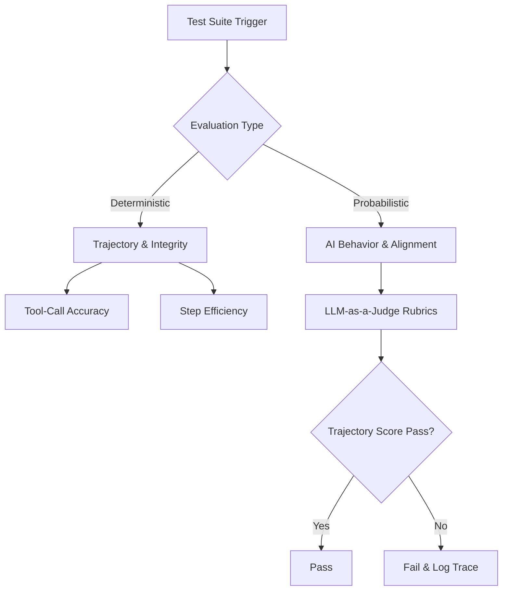

# 🌌 Antigravity Base Agentic Environment


## 🏗️ System Architecture

*Technical View:*


## 🔄 Agentic Handover Flow

*Technical View:*


## 📖 Overview
This repository serves as a powerful, extensible **Base Agentic Environment** built on the Antigravity framework. It utilizes a strict **Split-Plane Architecture** that separates the human-defined control plane (`.agents/`) from the system-managed data and state plane (`data/`). This ensures deterministic AI execution, zero-hallucination context management, and enterprise-grade reliability.

## 🚀 Dynamic Skill Integration
This workspace is designed to be highly composable. **As new skills and agents are developed in separate, isolated projects, they are continuously imported into this base environment.** This aggregation allows the environment to grow exponentially more powerful over time, consolidating isolated intelligence into a single, unified operating system.

## 📦 Installation & Setup (Standalone Execution)

```bash
# 1. Clone the repository
git clone https://github.com/hitanshuac/antigravity-agentic-governance-template.git
cd antigravity-agentic-governance-template

# 2. Provision Remote Secrets (Autonomous)
# Before writing code, instruct your AI Agent to secure the CI/CD pipeline:
# -> "Please run .agents/workflows/setup-secrets.md to provision my GitHub Actions."

# 3. (Optional) Create and activate a virtual environment
python -m venv .venv
# On Windows: .venv\Scripts\activate
# On Linux/Mac: source .venv/bin/activate

# 4. Install dependencies
pip install -r requirements.txt
```


## 🛠️ Current Capabilities

### Governance Rules (`.agents/rules/`)
* **12-Factor Governance:** Enforces all 12 factors of stateless processes and BYOK configuration.
* **Defensive Programming:** Pydantic schema-first data contracts and fail-fast operations to prevent silent data loss.
* **Rule Conflict Resolution:** 5-tier safety hierarchy ensuring Data Integrity (Tier 0) always overrides Style/Compliance (Tiers 3-4).
* **Testing Standards:** Mandates the Test Pyramid, state-aware integration tests, and fixture verification gates.
* **Linting & Code Quality:** Enforces exponential-speed static analysis via Ruff, and explicit enterprise-grade code structures.
* **No Unauthorized Deletions:** Strictly forbids destructive actions without manual approval, with semantic merge exemptions.
* **Error Observability:** Mandatory error interception, pre-write verification gates, and AST compression via jCodeMunch.
* **Context Compaction & Router Alignment:** Strict token conservation and payload mutation for Agentic AI.
* **Data Validation:** Idempotent DLQ routing and robust schema enforcement for local JSON files.
* **SQL Standards:** Write-Ahead Logging and `INSERT OR REPLACE` idempotency via DuckDB.
* **Anti-AI-Slop Design:** Constrains the agent to output professional-grade, high-fidelity design standards, avoiding generic UI tropes.
* **SRE Standard Operating Procedure:** Rhythmic Inner and Outer loops enforcing deterministic verification after every iteration.
* **Hugging Face & SAST Standards:** Zero-cost offsite WebUI routing deployment and OPSEC-sanitized remote evaluation compliance.
* **Environment Awareness:** Mandatory pre-flight dependency scans to prevent language hallucination in non-Python workspaces.
* **Anti-Over-Engineering:** Enforces the 7-step Ponytail decision ladder (YAGNI, Context, Stdlib, Native, Dependencies, One-Liner, Minimum Viable Code).
* **Language-Agnostic Engine:** Exposes governance rules as tools via a strict `stdio` Model Context Protocol (MCP) server for cross-ecosystem agent support.
* **Modular Competition Rules:** Hackathon-specific logistics (e.g., Hack2Skill) are modularized and optionally toggleable.


### Product & Systems Design (`.agents/product/`)
* **Product Templates:** Pre-defined frameworks for PRDs, Technical Architecture (TAD), Security Specs, Frontend Specs, and Feature Ticket Lists to guarantee deterministic AI output.
* **Architecture Decision Records (ADRs):** Immutable log of architectural choices (`.agents/architecture/adrs/`).

### Specialized Skills (`.agents/skills/`)
* **LangGraph Orchestrator:** Scaffolds state machines with typed state, checkpointing, and conditional routing.
* **Multi-Agent Crew:** Builds agent teams with strict role contracts, typed output schemas, and hard-fail delegation.
* **RAG Pipeline:** Builds production-grade RAG with structure-aware chunking, hybrid retrieval, and cross-encoder reranking.
* **Agent Evals:** Builds evaluation harnesses using trajectory scoring, tool-call accuracy metrics, and LLM-as-judge rubrics.
* **MCP Server Architect:** Scaffolds custom tools strictly as Model Context Protocol (MCP) servers using the official SDK.
* **Telemetry & Tracing:** Implements LangSmith/OpenTelemetry tracing across all agentic nodes to prevent orphaned spans.
* **Episodic Memory Manager:** Integrates Mem0/Zep for cross-session state, explicitly segregating conversational memory from RAG knowledge.
* **Prompt Registry Sync:** Externalizes all LLM prompts to markdown files, treating them as versionable assets.
* **HITL Interrupts:** Compiles LangGraph workflows with strict Human-in-the-Loop (HITL) checkpoints for infrastructure-mutating actions.
* **Diagram Generator:** Programmatic generation of highly polished architecture diagrams via Python `diagrams` and `D2`.
* **DuckDB Optimizer:** Configures DuckDB for maximum reliability, data integrity, and memory safety.
* **Pipeline Architect:** Designs minimalist, fault-tolerant ETL pipelines using standard Python.
* **LLM Council:** Framework for multi-perspective, peer-reviewed decision-making using 5 distinct AI advisors.
* **Universal Ingestion:** Implements markitdown to flatten unstructured proprietary file formats into clean markdown streams.

### Automated Workflows (`.agents/workflows/`)
* **CI/CD & Sync:** `master-sync` (Conversational Harvesting), `update-docs`, `publish-showcase`, `secure-checkpoint`, `semantic-release`, `sync-upstream`, `sync-ci-errors`
* **Universal DevOps Deployer:** `deploy-hf-production` (Dockerizes and deploys any Node, Go, Rust, or Python codebase natively to Hugging Face via Git), `deploy-streamlit-production`
* **Security & Quality:** `security-sast` (Semgrep), `lint` (Ruff), `test-automation` (Framework Agnostic Stack Detection), `setup-secrets`
* **Product & Planning:** `generate-product-docs`, `code-generation-preflight`
* **Architecture & Assets:** `generate-diagrams`, `agentic-refactor`, `compliant-refactor`
* **Data Engineering:** `daily-ingestion`, `build-etl`, `error-recovery`, `build-api-router`
* **Bootstrapping:** `bootstrap` (Phase 0 Self-Upgrader), `git-discovery-preflight`, `merge-conflict-resolution`, `setup-git`

## 📂 Directory Structure
```text
.
├── .agents/            # The Control Plane: Rules, Skills, and Workflows (Human Edited)
├── .config/            # Environment configurations and MCP integrations
├── src/                # Application source code and Python starter kit (FastAPI, Routers, Capabilities)
├── data/               # The Data Plane: DuckDB metrics, Quarantine DLQs, and Parquet files (System Managed)
└── hf-webui/           # Hugging Face Spaces frontend deployment configurations
```


## 🧬 How to Adopt This Environment (Injection Method)
To test if this environment works as intended in your own projects, you do not need to rewrite your entire codebase. Instead, you inject the "Agentic Brain".

### For Brand New Projects (Fresh Start)
If you are starting a new project (e.g., `mental-wellness-tracker`) and want to inherit these skills and rules from day one, give your IDE Copilot this exact prompt:
> *"Please initialize this project with my standard agentic governance template. Run `git clone https://github.com/hitanshuac/antigravity-agentic-governance-template.git .agents_temp`, move the `.agents_temp/.agents/` directory into the root of this project. If this is a Python project, also copy the `.agents_temp/src/` folder to get the batteries-included starter kit. Delete the temp folder. Once that is done, execute `/.agents/workflows/bootstrap.md` to scaffold the rest of the environment."*

### For Existing Projects (Upgrading)
If your project already has an older `.agents/` folder, you can safely pull down the latest rules (like new LangGraph or Multi-Agent skills) without overwriting your custom modifications. Simply tell the IDE:
> *"/ask run @[.agents/workflows/bootstrap.md]"*

The workflow will automatically clone the latest upstream template, merge in the new skills and rules, and present you with a list of old/deprecated files to delete. **It will explicitly ask for your manual confirmation before deleting any deprecated files.**

---

## 📊 Visual Reference Appendix

### The Agentic Handover Workflow

*Technical View:*


### Dual-Prong Testing Architecture (2026 Evals Standard)


## 🌟 Acknowledgments
This Agentic Environment architecture is built upon the foundational concepts and skills cloned and adapted from the **study antigravity** repository. Massive credit to the original author for the design patterns and capabilities that power this framework.

[View Agentic Environment Documentation](AGENT_DOCS.md)
