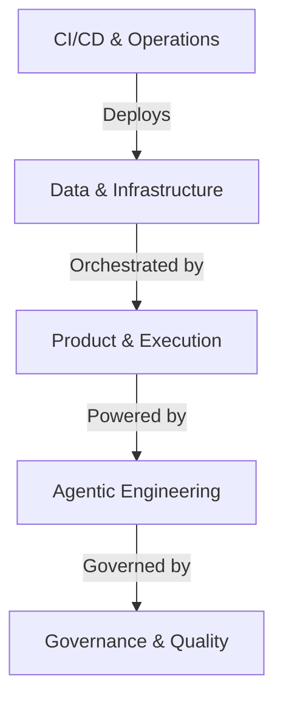
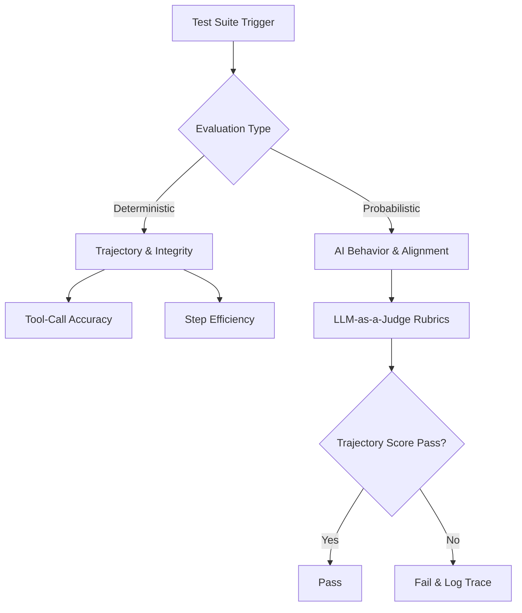

# Antigravity Base Agentic Environment


## System Architecture


## Agentic Handover Flow


> [!NOTE]
> **Zero-Clone Asset Architecture:** To keep repository cloning lightning fast, this template uses the Orphan Branch Pattern. Binary showcase images are strictly excluded from the `main` branch (via `.gitignore`) and hosted entirely on the decoupled `showcase-assets` branch. A standard `git clone` will download 0 bytes of binary image data.

## Dependency Graph (AST)


This project uses [repowise](https://repowise.dev) to build a **Tree-sitter AST dependency graph** across all project code. The graph captures imports, function calls, class inheritance, and co-change patterns — then ranks nodes by PageRank and betweenness centrality.

```bash
# First-time setup (no API key needed)
repowise init --yes --mode fast --no-editor-setup --no-claude-md --no-agents

# View the interactive dependency graph dashboard
repowise serve
# → Open http://localhost:3000

# Incremental update after code changes
repowise update
```

**Current index:** 564 nodes · 498 edges · Health score: 9.7/10 (Healthy)

## Overview
This repository serves as a powerful, extensible **Base Agentic Environment** built on the Antigravity framework. It utilizes a strict **Split-Plane Architecture** that separates the human-defined control plane (`.agents/`) from the system-managed data and state plane (`data/`). This ensures deterministic AI execution, zero-hallucination context management, and enterprise-grade reliability.

## Dynamic Skill Integration
This workspace is designed to be highly composable. **As new skills and agents are developed in separate, isolated projects, they are continuously imported into this base environment.** This aggregation allows the environment to grow exponentially more powerful over time, consolidating isolated intelligence into a single, unified operating system.

## Installation & Setup (Standalone Execution)

```bash
# 1. Clone the repository
git clone https://github.com/hitanshuac/antigravity-agentic-governance-template.git
cd antigravity-agentic-governance-template

# 2. Provision Remote Secrets (Autonomous)
# Before writing code, instruct your AI Agent to secure the CI/CD pipeline:
# -> "Please run .agents/workflows/setup-secrets.md to provision my GitHub Actions."

# 3. (Optional) Create and activate a virtual environment
python -m venv .venv
# On Windows: .venv\Scripts\activate
# On Linux/Mac: source .venv/bin/activate

# 4. Install dependencies
pip install -r requirements.txt
```


## Current Capabilities

### Governance Rules (`.agents/rules/`)
* **12-Factor Governance:** Enforces all 12 factors of stateless processes and BYOK configuration.
* **Defensive Programming:** Pydantic schema-first data contracts and fail-fast operations to prevent silent data loss.
* **Rule Conflict Resolution:** 5-tier safety hierarchy ensuring Data Integrity (Tier 0) always overrides Style/Compliance (Tiers 3-4).
* **Testing Standards:** Mandates the Test Pyramid, state-aware integration tests, and fixture verification gates.
* **Linting & Code Quality:** Enforces exponential-speed static analysis via Ruff, and explicit enterprise-grade code structures.
* **No Unauthorized Deletions:** Strictly forbids destructive actions without manual approval, with semantic merge exemptions.
* **Error Observability:** Mandatory error interception, pre-write verification gates, and AST compression via jCodeMunch.
* **Context Compaction & Router Alignment:** Strict token conservation and payload mutation for Agentic AI.
* **Data Validation:** Idempotent DLQ routing and robust schema enforcement for local JSON files.
* **SQL Standards:** Write-Ahead Logging and `INSERT OR REPLACE` idempotency via DuckDB.
* **Anti-AI-Slop Design:** Constrains the agent to output professional-grade, high-fidelity design standards, avoiding generic UI tropes.
* **SRE Standard Operating Procedure:** Rhythmic Inner and Outer loops enforcing deterministic verification after every iteration.
* **Hugging Face & SAST Standards:** Zero-cost offsite WebUI routing deployment and OPSEC-sanitized remote evaluation compliance.
* **Environment Awareness:** Mandatory pre-flight dependency scans to prevent language hallucination in non-Python workspaces.
* **Anti-Over-Engineering:** Enforces the 7-step Ponytail decision ladder (YAGNI, Context, Stdlib, Native, Dependencies, One-Liner, Minimum Viable Code).
* **Language-Agnostic Engine:** Exposes governance rules as tools via a strict `stdio` Model Context Protocol (MCP) server for cross-ecosystem agent support.
* **Skill Bifurcation:** Intelligent skill pack filtering that dynamically ships ecosystem-specific skills (e.g., JavaScript Web vs Python API) based on project structure.
* **Modular Competition Rules:** Hackathon-specific logistics (e.g., Hack2Skill) are modularized and optionally toggleable.


### Product & Systems Design (`.agents/product/`)
* **Product Templates:** Pre-defined frameworks for PRDs, Technical Architecture (TAD), Security Specs, Frontend Specs, and Feature Ticket Lists to guarantee deterministic AI output.

## Intelligence Domains: Skills & Workflows

This environment organizes its **50 Skills** and **7 Core Orchestration Workflows** into interdependent domains. Skills provide the agent with modular, progressive-disclosure capabilities and patterns, while Workflows orchestrate those skills into multi-step, deterministic execution plans.


```mermaid
graph TD
    %% Domains
    GOV[Governance & Quality]
    AGENT[Agentic Engineering]
    PROD[Product & Execution]
    DATA[Data & Infrastructure]
    OPS[CI/CD & Operations]

    %% Dependencies
    AGENT -->|Governed by| GOV
    PROD -->|Powered by| AGENT
    DATA -->|Orchestrated by| PROD
    OPS -->|Deploys| DATA
```

### 1. Governance & Quality Control (The Foundation)
Ensures zero-defect compliance, data integrity, and deterministic execution.
*   **Skills:**
    *   `code-quality`: Enterprise Code Quality Standards (SAST, Ruff).
    *   `defensive-programming`: Schema validation, fast-failing, and idempotency.
    *   `design-standards`: Anti-over-engineering and high-fidelity UI design.
    *   `error-pattern-library`: Living reference of common failure patterns with proven fixes.
    *   `governance-eval`: Self-evaluates against the repository's governance scorecard.
    *   `safe-merge`: Non-destructive semantic merge and conflict resolution.
    *   `sast-compliance`: Strict engineering rules for zero-defect compliance against AI code analyzers.
    *   `test-engineering`: Pytest, fixtures, and state-aware integration tests.

### 2. Agentic Engineering & Harnesses (The Inner Loop)
Patterns that improve how the LLM communicates with itself, reflects, and self-corrects.
*   **Skills:**
    *   `agent-evals`: Builds evaluation harnesses using trajectory scoring and LLM-as-judge.
    *   `context-compactor`: Manages LLM context window via sliding windows and compaction.
    *   `hitl-interrupts`: Compiles LangGraph workflows with Human-in-the-Loop checkpoints.
    *   `langgraph-orchestrator`: Scaffolds production-grade LangGraph state machines.
    *   `llm-council`: Runs decisions through a council of 5 AI peer-reviewers (Karpathy council pattern).
    *   `loop-detector`: Detects runaway retry cycles and forces structured escalation.
    *   `mcp-server-architect`: Scaffolds custom Model Context Protocol (MCP) servers using the official SDK.
    *   `multi-agent-crew`: Builds multi-agent teams with strict role contracts and typed schemas.
    *   `prompt-registry-sync`: Externalizes LLM prompts to versionable markdown.
    *   `quota-optimizer`: Prevents excessive API quota drain during autonomous agent runs.
    *   `self-reflection`: 5-point Reflexion protocol for structured self-critique.
    *   `session-memory`: Persists key decisions across long coding sessions (`SESSION_LOG.md`).
    *   `structured-output`: Enforces Pydantic-based JSON schemas for LLM calls.
    *   `telemetry-tracing`: Implements LangSmith/OpenTelemetry tracing across agentic nodes.

### 3. Product & Execution (The Outer Loop)
Rapid prototyping, spec-driven development, and time-pressured hackathon velocity.
*   **Skills:**
    *   `competitive-recon`: Rapid landscape scan, gap analysis, and differentiation framing.
    *   `demo-first`: Builds demo script and "wow moment" BEFORE implementation.
    *   `developing-with-streamlit`: Master skill for all Streamlit applications and custom components.
    *   `hackathon-sprint`: Master 5-phase time-boxed sprint orchestrator.
    *   `meta-agent-formats`: Standardized output templates for Rules, Proposals, and Reviews.
    *   `product-docs`: Interview-driven PRD, TAD, Security, and Ticket generator.
    *   `rapid-prototyping`: 5-minute scaffolds for Streamlit, Gradio, and FastAPI+HTMX.
    *   `spec-first`: Spec-Driven Development (produces `SPEC.md`, `ARCHITECTURE.md`, `TASKS.md`).

### 4. Data Engineering & Infrastructure (The Data Plane)
Scalable pipelines, RAG systems, and memory stores.
*   **Skills:**
    *   `build-etl`: Scaffolds fault-tolerant ETL pipelines with circuit-breaker error recovery.
    *   `data-quality-contracts`: Schema validation at pipeline boundaries using Pandera.
    *   `duckdb-optimizer`: Configures DuckDB for maximum reliability, data integrity, and speed.
    *   `episodic-memory-manager`: Integrates Episodic Memory (Mem0/Zep).
    *   `pipeline-architect`: Designs minimalist, fault-tolerant ETL pipelines.
    *   `rag-pipeline`: Production-grade RAG with structure-aware chunking and cross-encoder reranking.
    *   `universal-ingestion`: Implements MarkItDown to flatten unstructured files into clean markdown.

### 5. Full-Stack & APIs
*   **Skills:**
    *   `build-fastapi`: Scaffolds production-grade FastAPI router cascades following 12-Factor methodology.
    *   `build-nextjs-api`: Scaffolds production-grade Next.js serverless and edge API routes.
    *   `deploy-vercel`: Production deployment to Vercel for Next.js, Vite, and Python serverless.
    *   `omniroute-gateway`: Local AI gateway integration and model routing.

### 6. CI/CD & Operations (The Deployment Plane)
Deployment, Git orchestration, and automated maintenance.
*   **Skills:**
    *   `agentic-refactor`: 5-phase decomposition of God Objects using AST discovery and archon.
    *   `ci-error-sync`: Fetches and diagnoses remote GitHub Actions failures via `gh` CLI.
    *   `dead-code-cleanup`: Mathematical dead-code pruning with Vulture, Pycln, and AST scans.
    *   `diagram-generation`: Dual-engine pipeline combining Repowise AST graphs + D2 conceptual diagrams.
    *   `doc-sync`: Diff-based synchronization of documentation.
    *   `git-discovery`: Prior-art search on GitHub before writing custom code.
    *   `publish-showcase`: Verifies documentation assets and synthesizes README releases.
*   **Workflows:** 
    *   `bootstrap`: Local environment setup, validation, and template scaffolding.
    *   `compliant-refactor`: SRE-compliant refactoring with defensive checks and test gates.
    *   `master-sync`: Master 8-phase orchestration for validation, docs, diagrams, and checkpointing.
    *   `secure-checkpoint`: Mandatory Tier 0 commit-and-push workflow to GitHub.
    *   `setup-git`: Autonomous Git repo initialization and remote provisioning via `gh repo create`.
    *   `setup-secrets`: Autonomous auditing and secure GitHub Secrets injection.
    *   `sync-upstream`: Safe backporting of hardened rules and workflows to upstream Git SSOT.

## Directory Structure
```text
.
├── .agents/            # The Control Plane: Rules, Skills, and Workflows (Human Edited)
├── .config/            # Environment configurations and MCP integrations
├── src/antigravity/    # Application source code and Python starter kit (FastAPI, Routers, Capabilities)
├── data/               # The Data Plane: DuckDB metrics, Quarantine DLQs, and Parquet files (System Managed)
└── hf-webui/           # Hugging Face Spaces frontend deployment configurations
```


## How to Adopt This Environment (Injection Method)
To test if this environment works as intended in your own projects, you do not need to rewrite your entire codebase. Instead, you inject the "Agentic Brain".

### For Brand New Projects (Fresh Start)
Create a new project directly from this template using the GitHub CLI:
```bash
gh repo create my-project --template hitanshuac/antigravity-agentic-governance-template
```
Once cloned, open the project in your IDE and execute `/.agents/workflows/bootstrap.md` to finish scaffolding.

### For Existing Projects (Injection)
If your project already exists and you just want to inject governance capabilities, run this in your terminal:
```bash
git clone https://github.com/hitanshuac/antigravity-agentic-governance-template .gov-temp
cp -r .gov-temp/.agents . && rm -rf .gov-temp
```
Then tell your IDE Copilot: `Execute /.agents/workflows/bootstrap.md`

### Upgrading an Existing Installation
If your project already has an older `.agents/` folder, tell the IDE:
> *"/ask run @[.agents/workflows/bootstrap.md]"*

The workflow will automatically clone the latest upstream template, merge in the new skills and rules, and present you with a list of old/deprecated files to delete. **It will explicitly ask for your manual confirmation before deleting any deprecated files.**

---

## Visual Reference Appendix

### The Agentic Handover Workflow


### Dual-Prong Testing Architecture (2026 Evals Standard)

```mermaid
graph TD
    A[Test Suite Trigger] --> B{Evaluation Type}
    B -->|Deterministic| C[Trajectory & Integrity]
    C --> D[Tool-Call Accuracy]
    C --> E[Step Efficiency]
    B -->|Probabilistic| G[AI Behavior & Alignment]
    G --> H[LLM-as-a-Judge Rubrics]
    H --> I{Trajectory Score Pass?}
    I -->|Yes| J[Pass]
    I -->|No| K[Fail & Log Trace]
```


[View Agentic Handover Directive](docs/antigravity/HANDOVER.md)
